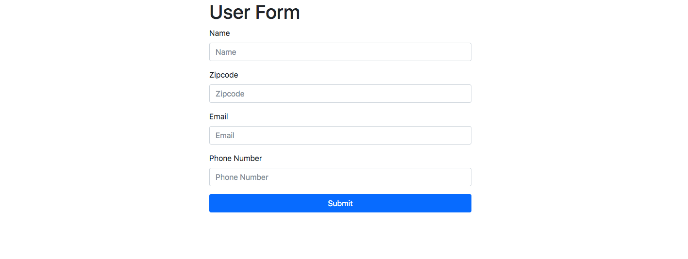
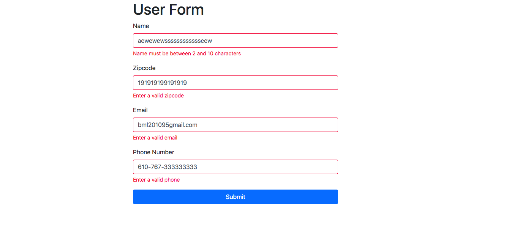
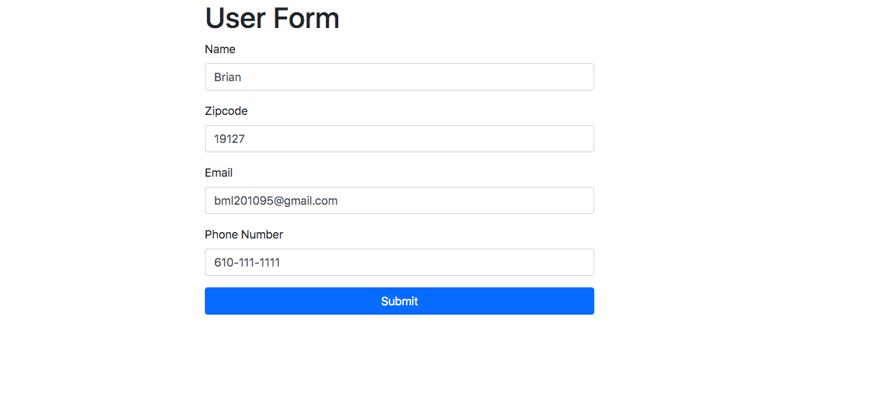

# Form-Validation

## Application  description:
In this application, I created a form which the user can fillout and submit.  The form was created using regular expressions which are used for pattern matching and searching. The values must be correct in the form otherwise there will be an error message.

 ## Click [here](https://brianlevin.github.io/Form-Validation/) for the live app. 
 
 This is the home screen:
 
 
  
  
 These are the invalid messages if the user doesnt put in the correct values.
  
  
  
  The user will get no errors if the input values are correct:
    
   
   once the user submits, the form will refresh:
       
   
## Libraries and Frameworks:

- HTML
- CSS
- Javascript

## Email:

bml201095@gmail.com

https://brianlevin.github.io/Form-Validation/
